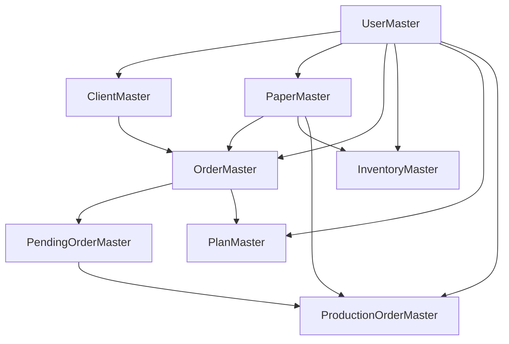

# 📊 Paper Roll Management System - Data Flow Architecture

## Overview
This document outlines the complete data flow architecture of the Paper Roll Management System, built on a master-based architecture that ensures data consistency, eliminates duplication, and provides clear audit trails.

## 🏗️ Master Tables Hierarchy

### Foundation Layer
The system is built on a hierarchical master-based architecture where each table has specific dependencies and creation order.



---

## 🌊 Complete Data Flow Process

### Phase 1: Setup & Master Data Creation

#### 1.1 UserMaster (Foundation)
**Purpose**: System foundation - all other records are created by users
**Creation Order**: #1 (Must exist first)

```sql
UserMaster
├── id (Primary Key - UNIQUEIDENTIFIER)
├── name, username, password_hash
├── role (sales, planner, supervisor, admin)
├── contact, department
├── created_at, last_login
└── status (active, inactive)
```

**Key Relationships**:
- Creates all other master records
- Tracks who created what (audit trail)

#### 1.2 ClientMaster (Customer Data)
**Purpose**: Stores customer company information
**Creation Order**: #2 (Requires UserMaster)

```sql
ClientMaster
├── id (Primary Key)
├── company_name, email, contact_person
├── address, phone
├── created_by_id → UserMaster.id (Foreign Key)
├── created_at
└── status (active, inactive)
```

**Key Relationships**:
- `created_by` → UserMaster (who created this client)
- `orders` → OrderMaster (client's orders)

#### 1.3 PaperMaster (Product Specifications)
**Purpose**: Centralized paper specifications to eliminate duplication
**Creation Order**: #3 (Requires UserMaster)

```sql
PaperMaster
├── id (Primary Key)
├── name (e.g., "White Bond 90GSM")
├── gsm (Grams per square meter)
├── bf (Brightness Factor)
├── shade (Paper color)
├── thickness, type
├── created_by_id → UserMaster.id (Foreign Key)
├── created_at
└── status (active, inactive)
```

**Key Relationships**:
- `created_by` → UserMaster (who created this specification)
- `orders` → OrderMaster (orders using this paper)
- `inventory_items` → InventoryMaster (inventory of this paper)
- `production_orders` → ProductionOrderMaster (production for this paper)

---

### Phase 2: Order Processing & Management

#### 2.1 OrderMaster (Customer Orders)
**Purpose**: Customer orders linking clients to paper specifications
**Creation Order**: #4 (Requires Client + Paper + User)

```sql
OrderMaster
├── id (Primary Key)
├── client_id → ClientMaster.id (Foreign Key)
├── paper_id → PaperMaster.id (Foreign Key)
├── created_by_id → UserMaster.id (Foreign Key)
├── width_inches, quantity_rolls
├── quantity_fulfilled (tracking fulfillment)
├── status (pending → processing → completed)
├── priority (low, normal, high, urgent)
├── delivery_date, notes
├── created_at, updated_at
└── Properties: remaining_quantity, is_fully_fulfilled
```

**Status Flow**:
```
pending → processing → partially_fulfilled → completed
                    ↘ cancelled
```

**Key Relationships**:
- `client` → ClientMaster (which customer)
- `paper` → PaperMaster (what paper specification)
- `created_by` → UserMaster (who created the order)
- `pending_orders` → PendingOrderMaster (unfulfilled portions)
- `plan_orders` → PlanOrderLink (cutting plans)

#### 2.2 PendingOrderMaster (Unfulfilled Orders)
**Purpose**: Tracks orders that cannot be immediately fulfilled
**Creation Order**: #5 (Created when OrderMaster can't be fulfilled)

```sql
PendingOrderMaster
├── id (Primary Key)
├── order_id → OrderMaster.id (Foreign Key)
├── paper_id → PaperMaster.id (Foreign Key)
├── production_order_id → ProductionOrderMaster.id (Optional)
├── width_inches, quantity_pending
├── reason (no_inventory, no_jumbo, insufficient_stock)
├── status (pending → in_production → resolved)
├── created_at, resolved_at
```

**Common Reasons**:
- `no_inventory`: No suitable inventory available
- `no_jumbo`: No jumbo rolls for cutting
- `insufficient_stock`: Partial stock available

---

### Phase 3: Inventory & Stock Management

#### 3.1 InventoryMaster (Stock Management)
**Purpose**: Manages both jumbo rolls and cut rolls
**Creation Order**: #6 (Created from production or received stock)

```sql
InventoryMaster
├── id (Primary Key)
├── paper_id → PaperMaster.id (Foreign Key)
├── created_by_id → UserMaster.id (Foreign Key)
├── allocated_to_order_id → OrderMaster.id (Optional)
├── roll_type (jumbo, cut)
├── width_inches, weight_kg
├── location, qr_code
├── status (available → allocated → cutting → used)
├── production_date, created_at
```

**Status Flow**:
```
available → allocated → cutting → used
         ↘ damaged
```

**Roll Types**:
- `jumbo`: Large rolls for cutting into smaller sizes
- `cut`: Pre-cut rolls ready for delivery

---

### Phase 4: Optimization & Planning

#### 4.1 PlanMaster (Cutting Optimization)
**Purpose**: Stores cutting optimization plans to minimize waste
**Creation Order**: #7 (Created from multiple orders via optimizer)

```sql
PlanMaster
├── id (Primary Key)
├── created_by_id → UserMaster.id (Foreign Key)
├── name (Optional plan name)
├── cut_pattern (JSON array of cutting patterns)
├── expected_waste_percentage
├── actual_waste_percentage (after execution)
├── status (planned → in_progress → completed)
├── created_at, executed_at, completed_at
```

**Status Flow**:
```
planned → in_progress → completed
       ↘ failed
```

**Optimization Process**:
1. Groups orders by paper specifications (GSM, BF, shade)
2. Calculates optimal cutting patterns
3. Minimizes waste percentage
4. Creates execution plan

#### 4.2 PlanOrderLink (Plans ↔ Orders)
**Purpose**: Many-to-many relationship between plans and orders

```sql
PlanOrderLink
├── id (Primary Key)
├── plan_id → PlanMaster.id (Foreign Key)
├── order_id → OrderMaster.id (Foreign Key)
└── quantity_allocated (How many rolls from this order)
```

#### 4.3 PlanInventoryLink (Plans ↔ Inventory)
**Purpose**: Many-to-many relationship between plans and inventory

```sql
PlanInventoryLink
├── id (Primary Key)
├── plan_id → PlanMaster.id (Foreign Key)
├── inventory_id → InventoryMaster.id (Foreign Key)
└── quantity_used (Weight or length used)
```

---

### Phase 5: Production & Manufacturing

#### 5.1 ProductionOrderMaster (Manufacturing Queue)
**Purpose**: Manufacturing orders for new jumbo rolls
**Creation Order**: #8 (Created when inventory is insufficient)

```sql
ProductionOrderMaster
├── id (Primary Key)
├── paper_id → PaperMaster.id (Foreign Key)
├── created_by_id → UserMaster.id (Foreign Key)
├── quantity (Number of jumbo rolls to produce)
├── priority (low, normal, high, urgent)
├── status (pending → in_progress → completed)
├── created_at, started_at, completed_at
```

**Status Flow**:
```
pending → in_progress → completed
       ↘ cancelled
```

---

## 🔄 Complete Workflow Example

### Scenario: Customer Order Processing

#### Step 1: Order Creation
```
1. Sales user creates OrderMaster
   ├── Links to existing ClientMaster
   ├── Links to existing PaperMaster
   └── Status: pending
```

#### Step 2: Inventory Check
```
2. System checks InventoryMaster
   ├── If sufficient inventory exists:
   │   ├── Allocate inventory (status: available → allocated)
   │   └── Update OrderMaster.quantity_fulfilled
   └── If insufficient inventory:
       └── Create PendingOrderMaster
```

#### Step 3: Optimization (for multiple orders)
```
3. CuttingOptimizer processes pending orders
   ├── Groups by PaperMaster specifications
   ├── Calculates optimal cutting patterns
   ├── Creates PlanMaster
   ├── Links via PlanOrderLink
   └── Links via PlanInventoryLink
```

#### Step 4: Production (if needed)
```
4. If no suitable jumbo rolls exist:
   ├── Create ProductionOrderMaster
   ├── Link to PendingOrderMaster
   └── Queue for manufacturing
```

#### Step 5: Execution
```
5. Execute cutting plan:
   ├── Update InventoryMaster (allocated → cutting → used)
   ├── Update OrderMaster.quantity_fulfilled
   ├── Update PlanMaster (planned → in_progress → completed)
   └── Resolve PendingOrderMaster if applicable
```

---

## 🎯 Key Architecture Benefits

### Data Consistency
- **Single Source of Truth**: Paper specifications stored once in PaperMaster
- **Referential Integrity**: All relationships enforced via foreign keys
- **No Duplication**: Master-based approach eliminates redundant data

### Audit Trail
- **Created By Tracking**: Every record tracks who created it
- **Timestamp Tracking**: Creation and modification times recorded
- **Status History**: Status changes tracked throughout lifecycle

### Scalability
- **Normalized Design**: Efficient storage and querying
- **Master-Based**: Easy to add new paper types, clients, users
- **Flexible Relationships**: Many-to-many links support complex scenarios

### Business Logic
- **Optimization Integration**: Cutting optimizer works with master data
- **Workflow Management**: Clear progression through business states
- **Production Planning**: Automatic production order creation

---

## 📊 Status Progressions Summary

| Table | Status Flow |
|-------|-------------|
| **OrderMaster** | `pending` → `processing` → `partially_fulfilled` → `completed` |
| **PlanMaster** | `planned` → `in_progress` → `completed` |
| **InventoryMaster** | `available` → `allocated` → `cutting` → `used` |
| **ProductionOrderMaster** | `pending` → `in_progress` → `completed` |
| **PendingOrderMaster** | `pending` → `in_production` → `resolved` |

---

## 🔧 API Integration Points

### Master Data Management
- Client, User, Paper master CRUD operations
- Bulk operations for efficiency
- Status management across all masters

### Order Processing
- Order creation with master relationships
- Pending order tracking and resolution
- Fulfillment status updates

### Optimization Engine
- Multi-order processing
- Cutting pattern generation
- Plan execution and tracking

### Inventory Management
- Stock allocation and tracking
- QR code generation
- Location management

This master-based architecture ensures your Paper Roll Management System maintains data integrity while supporting complex business workflows efficiently.